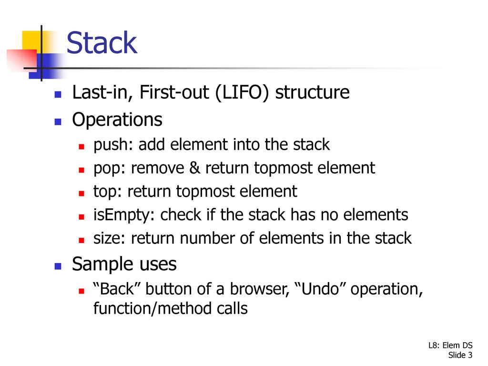

# Stacks
A stack is a type of data structure that uses last-in, first-out ordering to store items. LIFO is a common term used to describe this. In a stack, an element
is only removed from one end while a new element is put to the other end.

## Stack Functions and time complexity

| Function      | Explanation                                       | Time complexity|
| ------------- | ------------------------------------------------- | -------------- |
| empty()       | Returns whether the stack is empty                | O(1)           |
| size()        | Returns the size of the stack                     | O(1)           |
| top() / peek()| Returns a reference to the topmost element of the stack|  O(1)     |
| push()|  Inserts an element at the top of the stack |  O(1)     |
| pop() | Deletes the topmost element of the stack |  O(1)     |

## Implementation

There are different ways from which a stack can be implemented in Python.

* List
* Collections.deque
* queue.LifoQueue

### List Implementation

