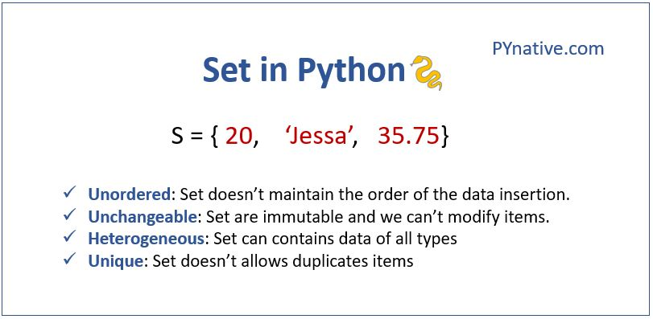
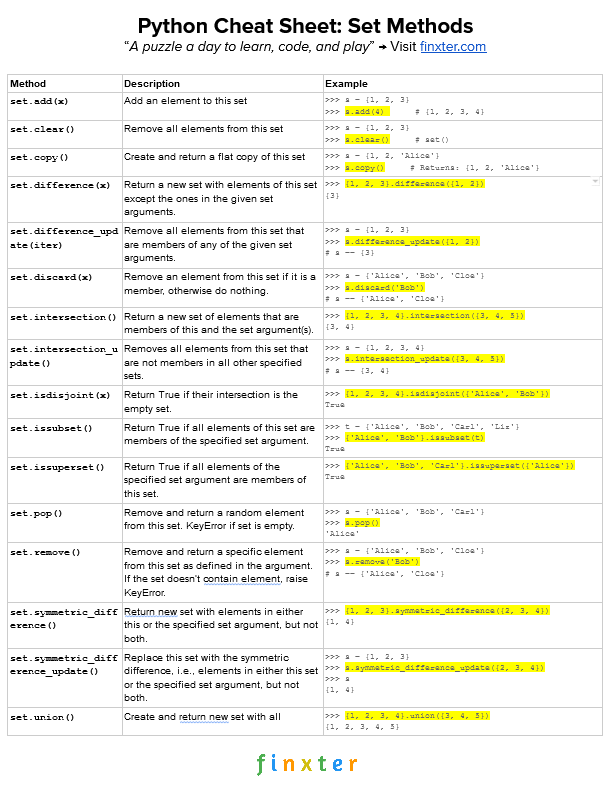

# Sets
A Set is an iterable, changeable, and duplicate-free unordered collection data type. The mathematical concept of a set is represented by the set class in Python. A set has a highly optimized way for determining whether a certain element is contained in the set, which is its main advantage over a list. This is based on a hash table, a type of data structure. Since sets are not ordered, we cannot use indexes to access items like we do with lists.

The built-in set type in Python includes the following features:

* Sets have no order.
* Set components are special. Elements cannot have duplicates.
* Although the elements that make up a set may be changed, the set itself must be immutable.



## Sets methods and time complexity

| Function      | Explanation                                       | Time complexity|
| ------------- | ------------------------------------------------- | -------------- |
| add()       | Adds an element to the set   | O(1)           |
| clear()        | Removes all the elements from the set | O(1)|
| copy()     | Returns a copy of the set | O(1)|
| difference()| Returns a set containing the difference between two or more sets|  O(1)     |
| difference_update()|  Removes the items in this set that are also included in another, specified set |  O(1)     |
| discard() | Remove the specified item |  O(1)     |
| intersection() | Returns a set, that is the intersection of two other sets |  O(1)     |
| intersection_update() | Removes the items in this set that are not present in other, specified set(s) |  O(1)     |
| isdisjoint() | Returns whether two sets have a intersection or not |  O(1)     |
| issubset() | Returns whether another set contains this set or not |  O(1)     |
| issuperset() | Returns whether this set contains another set or not |  O(1)     |
| pop() | Removes an element from the set |  O(1)     |
| remove() | Removes the specified element |  O(1)     |
| symmetric_difference() | Returns a set with the symmetric differences of two sets |  O(1)     |
| symmetric_difference_update() | inserts the symmetric differences from this set and another |  O(1)     |
| union() | Return a set containing the union of sets |  O(1)     |
| update() | Update the set with the union of this set and others |  O(1)     |



## Implementation
### Frozen Sets

Python supports only methods and operators that deliver results without changing the frozen set or sets to which they are applied. Frozen sets are immutable objects. A set's components can be changed at any moment, but the components of a frozen set don't change after they've been created.
It returns an empty frozenset if no arguments are supplied.

```python
    # The python file below cannot compile because the user is trying to change an item in a set
    #
mylist = ['apple', 'banana', 'cherry']
x = frozenset(mylist)
x[1] = "strawberry" #Trying to change an item in a set
print(x)
```

Output:
```python
Traceback (most recent call last):
  File "demo_ref_frozenset2.py", line 3, in <module>
    x[1] = "strawberry"
TypeError: 'frozenset' object does not support item assignment
```
### Creating Python Sets
All of the components (items) must be enclosed in curly braces {}, separated by commas, or can be formed as a set by using the set() function.

There may be any number of things and various sorts inside it (integer, float, tuple, string etc.). However, a set cannot contain mutable items, such as lists, sets, or dictionaries.

```python
# Initializing a set
my_set = {}
print(my_set)

my_set = set()
print(my_set)

# Different types of sets in Python
# set of integers
my_set = {1, 2, 3}
print(my_set)

# set of mixed datatypes
my_set = {1.0, "Hello", (1, 2, 3)}
print(my_set)
```

Output
```python
{}
set()
{1, 2, 3}
{'Hello', 1.0, (1, 2, 3)}
```

### Modifying a set in Python
Sets can be changed. However, indexing is useless because they are unordered.

Indexing or slicing cannot be used to access or modify a set element. It is not supported by the set data type.

The add() method can be used to add a single element, and the update() method can be used to add many components. Tuples, lists, strings, and other sets can be passed to the update() method as arguments. Duplicates are avoided at all costs.

```python
# initialize my_set
my_set = {1, 3}
print(my_set)

# my_set[0]
# if you uncomment the above line
# you will get an error
# TypeError: 'set' object does not support indexing

# add an element
# Output: {1, 2, 3}
my_set.add(2)
print(my_set)

# add multiple elements
# Output: {1, 2, 3, 4}
my_set.update([2, 3, 4])
print(my_set)

# add list and set
# Output: {1, 2, 3, 4, 5, 6, 8}
my_set.update([4, 5], {1, 6, 8})
print(my_set)

```

```python
{1, 3}
{1, 2, 3}
{1, 2, 3, 4}
{1, 2, 3, 4, 5, 6, 8}
```
### Removing elements from a set
A particular item can be removed from a set using the methods discard() and remove().

The only difference between the two is that the discard() function leaves a set unchanged if the element is not present in the set. On the other hand, the remove() function will raise an error in such a condition (if element is not present in the set).

```python
# Difference between discard() and remove()

# initialize my_set
my_set = {1, 3, 4, 5, 6}
print(my_set)

# discard an element
# Output: {1, 3, 5, 6}
my_set.discard(4)
print(my_set)

# remove an element
# Output: {1, 3, 5}
my_set.remove(6)
print(my_set)

# discard an element
# not present in my_set
# Output: {1, 3, 5}
my_set.discard(2)
print(my_set)

# remove an element
# not present in my_set
# you will get an error.
# Output: KeyError

my_set.remove(2)
```
Output
```python
{1, 3, 4, 5, 6}
{1, 3, 5, 6}
{1, 3, 5}
{1, 3, 5}
Traceback (most recent call last):
  File "<string>", line 28, in <module>
KeyError: 2
```
The pop() method can be used in a similar way to delete and return an object.

Set is an unordered data type, hence it is impossible to predict which item will be displayed. It is entirely random.

The clear() method can also be used to eliminate every item from a set.

```python
# initialize my_set
# Output: set of unique elements
my_set = set("HelloWorld")
print(my_set)

# pop an element
# Output: random element
print(my_set.pop())

# pop another element
my_set.pop()
print(my_set)

# clear my_set
# Output: set()
my_set.clear()
print(my_set)
```
Output
```python
{'H', 'l', 'r', 'W', 'o', 'd', 'e'}
H
{'r', 'W', 'o', 'd', 'e'}
set()
```
