### Binary Search Tree(BST)
A data structure called a binary search tree makes it simple to keep track of a sorted list of numbers.

- It is because each tree node has a maximum of two offspring, it is known as a binary tree.
- It is because each because it may be used to search for the presence of a number in 'O(log(n))' time, it is known as a search tree.

The characteristics that set a binary search tree apart from a standard binary tree are

1. All nodes of left subtree are less than the root node
2. All nodes of right subtree are more than the root node
3. Both subtrees of each node are also BSTs i.e. they have the above two properties


__`A tree having a right subtree with one value smaller than the root is shown to demonstrate that it is not a valid binary search tree`__

The binary tree on the right isn't a binary search tree because the right subtree of the node `3` contains a value smaller than it.

There are two basic operations that you can perform on a binary search tree:

#### Search Operation
The algorithm depends on the property of BST that if each left subtree has values below root and each right subtree has values above the root.

If the value is below the root, we can say for sure that the value is not in the right subtree; we need to only search in the left subtree and if the value is above the root, we can say for sure that the value is not in the left subtree; we need to only search in the right subtree.

__Algorithm:__

```python
If root == NULL 
    return NULL;
If number == root->data 
    return root->data;
If number < root->data 
    return search(root->left)
If number > root->data 
    return search(root->right)
```

Let us try to visualize this with a diagram.


__`4 is not found so, traverse through the left subtree of 8`__

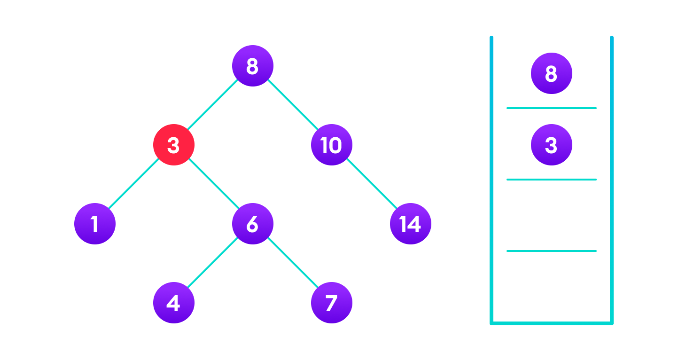
__`4 is not found so, traverse through the right subtree of 3`__

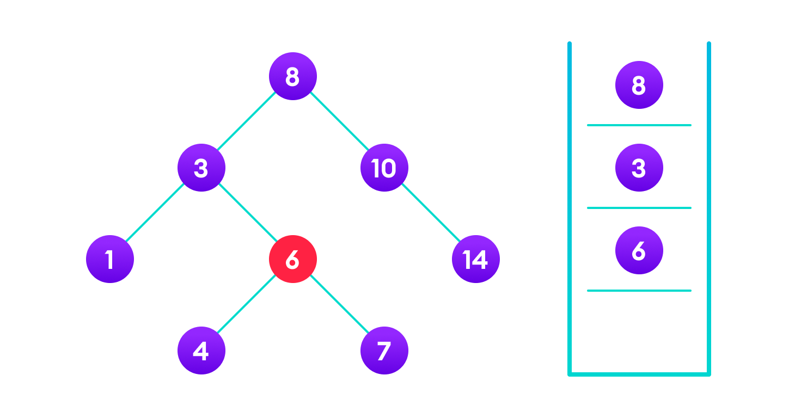
__`4 is not found so, traverse through the left subtree of 6`__

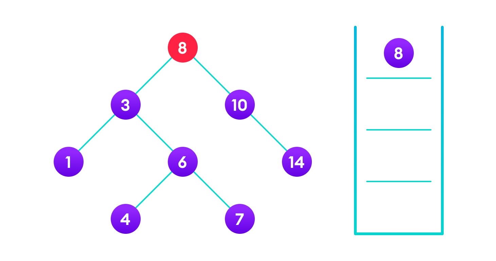
__`4 is found`__

If the value is found, we return the value so that it gets propagated in each recursion step as shown in the image below.

If you might have noticed, we have called return search(struct node*) four times. When we return either the new node or NULL, the value gets returned again and again until search(root) returns the final result.

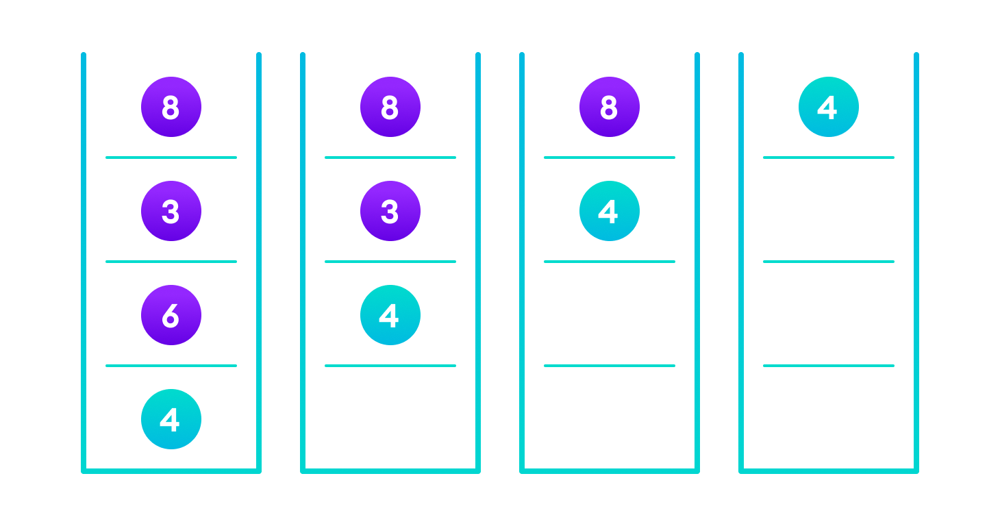
__`If the value is found in any of the subtrees, it is propagated up so that in the end it is returned, otherwise null is returned`__

If the value is not found, we eventually reach the left or right child of a leaf node which is NULL and it gets propagated and returned.

#### Insert Operation
Inserting a value in the correct position is similar to searching because we try to maintain the rule that the left subtree is lesser than root and the right subtree is larger than root.

We keep going to either right subtree or left subtree depending on the value and when we reach a point left or right subtree is null, we put the new node there.

__Algorithm:__

```python
If node == NULL 
    return createNode(data)
if (data < node->data)
    node->left  = insert(node->left, data);
else if (data > node->data)
    node->right = insert(node->right, data);  
return node;
```
The algorithm isn't as simple as it looks. Let's try to visualize how we add a number to an existing BST.

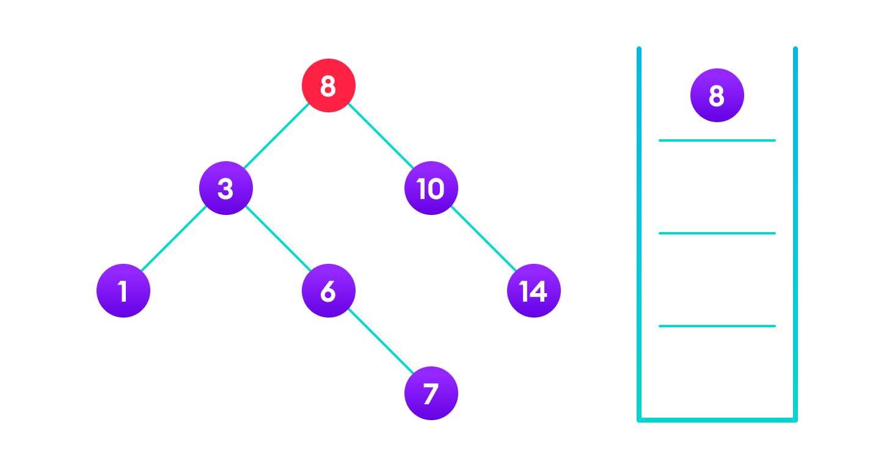
__`4<8 so, transverse through the left child of 8`__

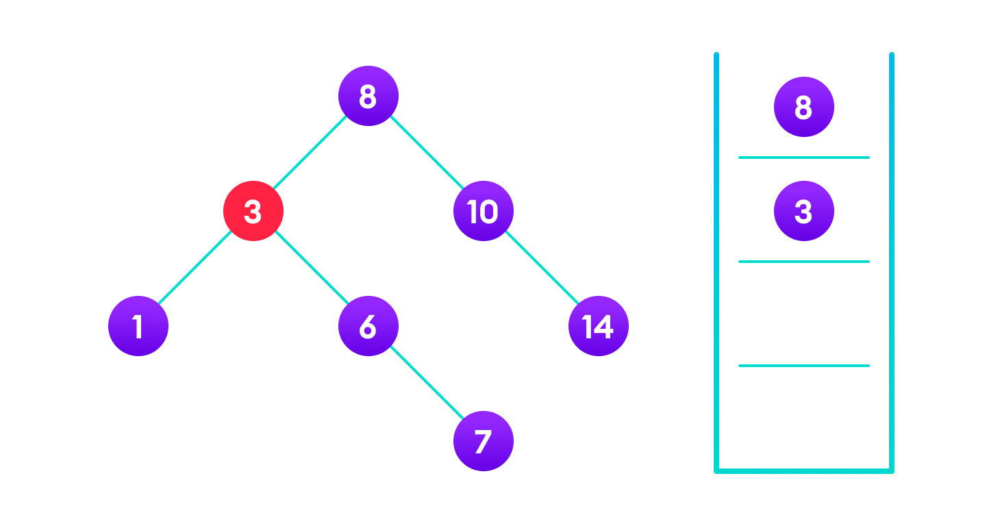
__`4>3 so, transverse through the right child of 8`__

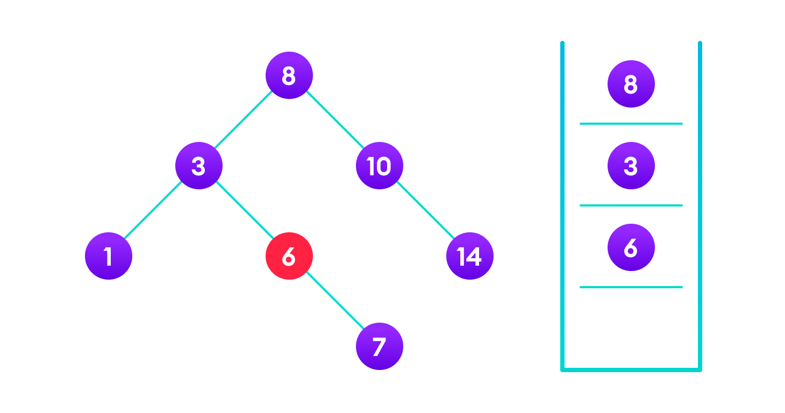
__`4<6 so, transverse through the left child of 6`__

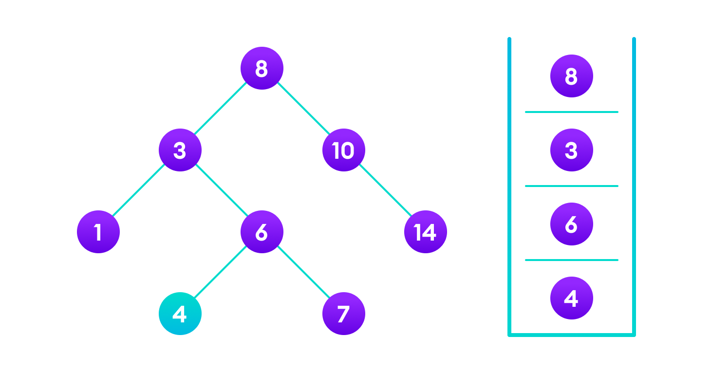
__`Insert 4 as a left child of 6`__

We have attached the node but we still have to exit from the function without doing any damage to the rest of the tree. This is where the `return node;` at the end comes in handy. In the case of `NULL`, the newly created node is returned and attached to the parent node, otherwise the same node is returned without any change as we go up until we return to the root.

This makes sure that as we move back up the tree, the other node connections aren't changed.


__`Image showing the importance of returning the root element at the end so that the elements don't lose their position during the upward recursion step.`__

### Deletion Operation
There are three cases for deleting a node from a binary search tree.

__Case 1__
In the first case, the node to be deleted is the leaf node. In such a case, simply delete the node from the tree.

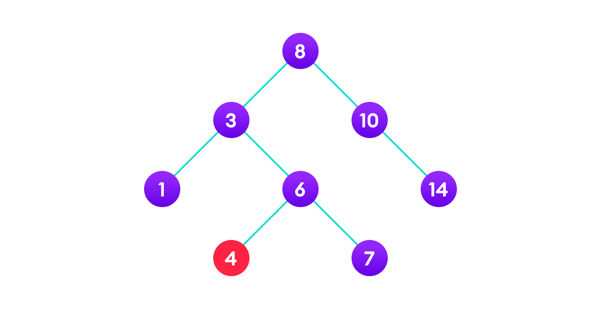
__`4 is to be deleted`__

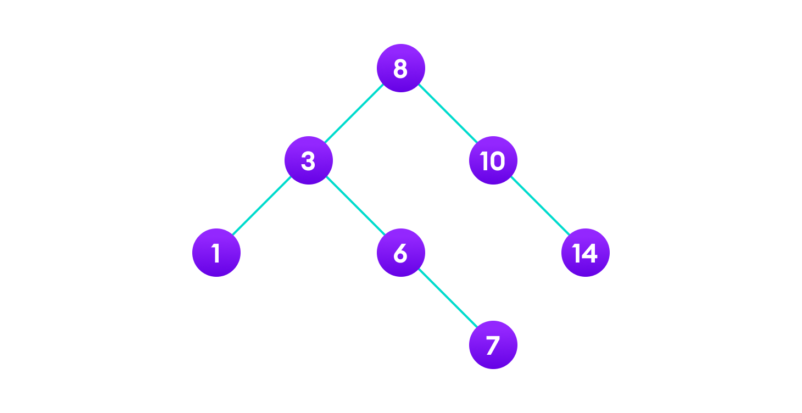
__`Delete the node`__

__Case 2__
In the second case, the node to be deleted lies has a single child node. In such a case follow the steps below:

1. Replace that node with its child node.
2. Remove the child node from its original position.

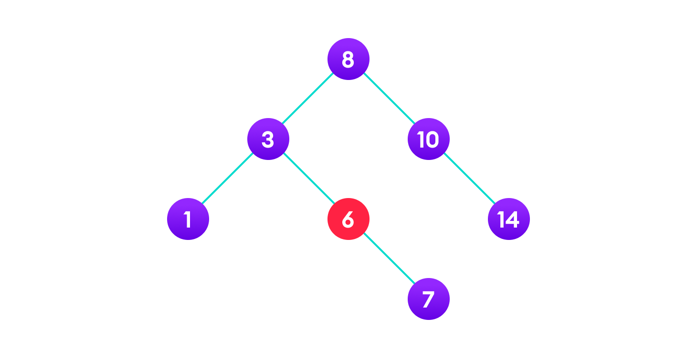
__`6 is to be deleted`__

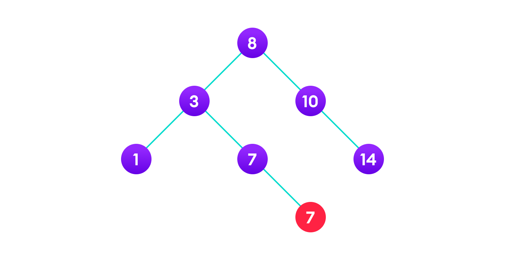
__`copy the value of its child to the node and delete the child`__

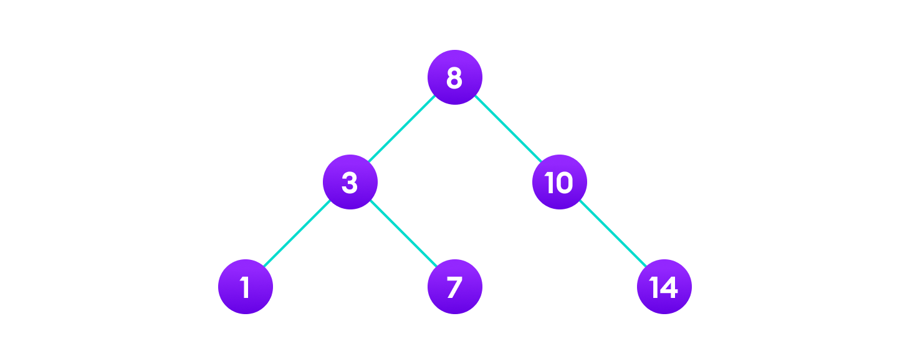
__`Final tree`__

__Case 3__
In the third case, the node to be deleted has two children. In such a case follow the steps below:

1. Get the inorder successor of that node.
2. Replace the node with the inorder successor.
3. Remove the inorder successor from its original position.

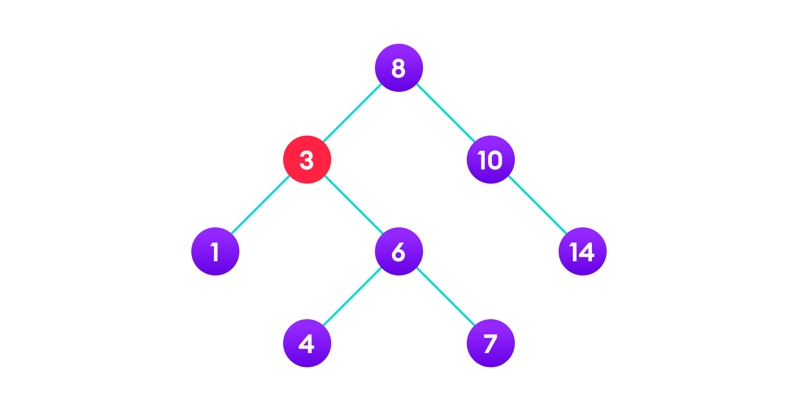
__`3 is to be deleted`__


__`Copy the value of the inorder successor (4) to the node`__


__`Delete the inorder successor`__

```python
# Binary Search Tree operations in Python


# Create a node
class Node:
    def __init__(self, key):
        self.key = key
        self.left = None
        self.right = None


# Inorder traversal
def inorder(root):
    if root is not None:
        # Traverse left
        inorder(root.left)

        # Traverse root
        print(str(root.key) + "->", end=' ')

        # Traverse right
        inorder(root.right)


# Insert a node
def insert(node, key):

    # Return a new node if the tree is empty
    if node is None:
        return Node(key)

    # Traverse to the right place and insert the node
    if key < node.key:
        node.left = insert(node.left, key)
    else:
        node.right = insert(node.right, key)

    return node


# Find the inorder successor
def minValueNode(node):
    current = node

    # Find the leftmost leaf
    while(current.left is not None):
        current = current.left

    return current


# Deleting a node
def deleteNode(root, key):

    # Return if the tree is empty
    if root is None:
        return root

    # Find the node to be deleted
    if key < root.key:
        root.left = deleteNode(root.left, key)
    elif(key > root.key):
        root.right = deleteNode(root.right, key)
    else:
        # If the node is with only one child or no child
        if root.left is None:
            temp = root.right
            root = None
            return temp

        elif root.right is None:
            temp = root.left
            root = None
            return temp

        # If the node has two children,
        # place the inorder successor in position of the node to be deleted
        temp = minValueNode(root.right)

        root.key = temp.key

        # Delete the inorder successor
        root.right = deleteNode(root.right, temp.key)

    return root


root = None
root = insert(root, 8)
root = insert(root, 3)
root = insert(root, 1)
root = insert(root, 6)
root = insert(root, 7)
root = insert(root, 10)
root = insert(root, 14)
root = insert(root, 4)

print("Inorder traversal: ", end=' ')
inorder(root)

print("\nDelete 10")
root = deleteNode(root, 10)
print("Inorder traversal: ", end=' ')
inorder(root)
```

### Binary Search Tree Complexities
##### Time Complexity

|   Operations |  Best Case Complexity | Average Case Complexity | Worst Case Complexity |
|:-------------|----------------------:|------------------------:| ---------------------:|
| Search       |              O(log n) |                O(log n) |                  O(n) |
| Insertion    |              O(log n) |                O(log n) |                  O(n) |
| Deletion     |              O(log n) |                O(log n) |                  O(n) |

Here, `n` is the number of nodes in the tree.

### Space Complexity
The space complexity for all the operations is `O(n)`.

### Binary Search Tree Applications
1. In multilevel indexing in the database
2. For dynamic sorting
3. For managing virtual memory areas in Unix kernel


### Traversals
There are three ways to traverse a tree: pre-order traversal, in-order traversal, and post-order traversal. The traversals are mostly implemented in the `Node` class.
We mentioned at the start of the article that BSTs can be useful for sorting data. As it turns out, the way in which you __traverse__ the tree structure will yield different element orderings that can be applied to a variety of applications.
The most straightforward example is sorting from least to greatest. If your BST contains all numbers, __an in-order traversal of the tree will return a list of all the numbers in the tree, sorted.__ Another application is the conversion of expressions between infix, prefix, and postfix. If you can represent an expression as an Abstract Syntax Tree (AST) or something similar, these conversions can be performed with an in-order, pre-order, or post-order traversal of the tree.

__In-Order Traversal__
An in-order traversal does the steps in the following order:
- Traverse the left Subtree
- Handle the current Node
- Traverse the right Subtree

This is best seen in the following diagram:

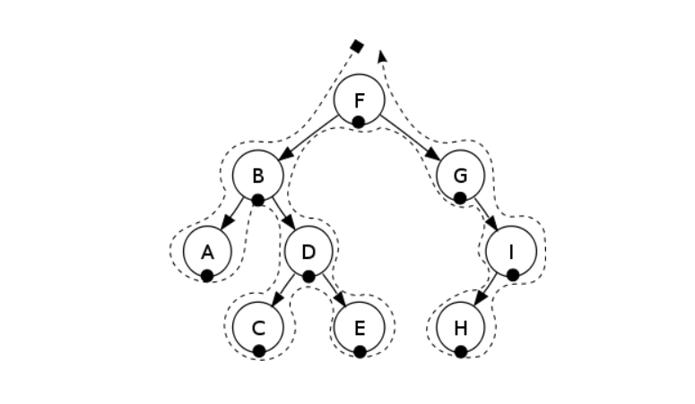

__Pre-order Traversal__
A pre-order traversal does the above steps in the following order:

- Handle the current Node
- Traverse the left Subtree
- Traverse the right Subtree

This is best seen in the following diagram:

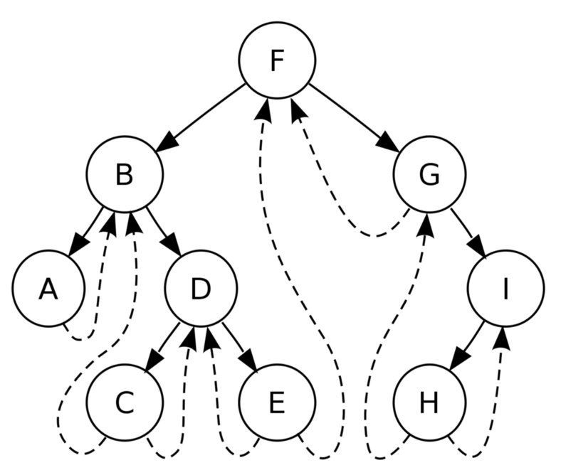

__Post-Order Traversal__
You can probably guess in what order a post-order traversal accomplishes it’s tasks:
- Traverse the left Subtree
- Traverse the right Subtree
- Handle the current Node

This is best seen in the following diagram:

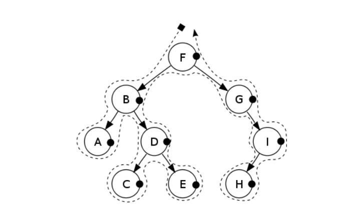

### Coding Problem
Given a BST and a key K. If K is not present in the BST, Insert a new Node with a value equal to K into the BST. 
__Note:__ If K is already present in the BST, don't modify the BST.

__Example 1:__

```
Input:
     2
   /   \
  1     3
K = 4
Output: 1 2 3 4
Explanation: After inserting the node 4
Inorder traversal will be 1 2 3 4.
```
__Example 2:__

```
Input:
        2
      /   \
     1     3
             \
              6
K = 4
Output: 1 2 3 4 6
Explanation: After inserting the node 4
Inorder traversal of the above tree
will be 1 2 3 4 6.
```
### Task
You don't need to read input or print anything. Your task is to complete the function __insert()__ which takes the root of the BST and Key K as input parameters and returns the root of the modified BST after inserting K. 
__Note:__ The generated output contains the inorder traversal of the modified tree.


- You can check your code with the solution here: [Solution](bst_solution.py)

[Back to Welcome Page](outline.md)
